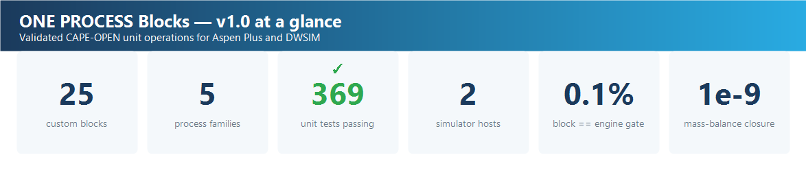
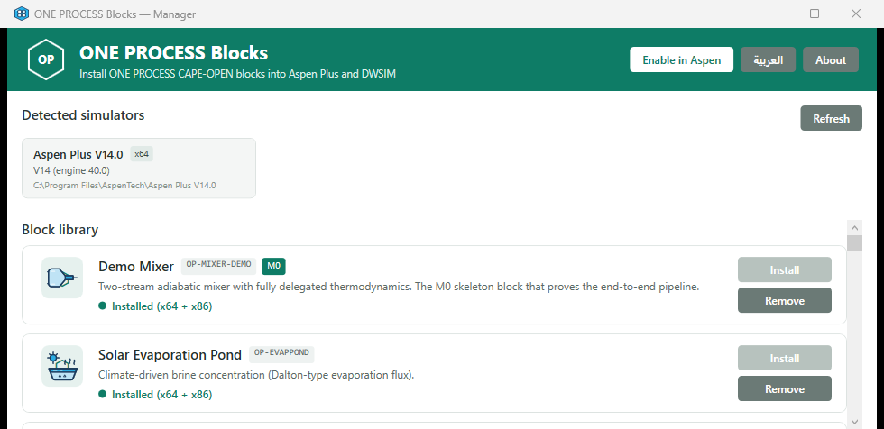

<div dir="rtl">

# ONE PROCESS Blocks (OP-Blocks)

[English](README.md) · **العربية**


**‏25 عملية وحدة (Unit Operation) مفتوحة المصدر بمعيار CAPE-OPEN، لمحاكاة معالجة
المياه والتحلية والليثيوم والطاقة الخضراء — لبرنامجَي Aspen Plus و DWSIM.**


كل بلوك يتبع النمط الهندسي نفسه: محرّك فيزيائي نقي بمراجع منشورة، ربط آمن مع
المضيف عبر واجهات CAPE-OPEN، فورم بتبويبين (المدخلات/النتائج)، وحزمة اختبارات
تحقّق مثبَّتة على مراجع علمية. **‏382 اختبار وحدة، كلها ناجحة** (حزم تحقّق لكل
بلوك + اختبارات البنية)، إضافةً إلى **مسح حيّ متقارب 25/25 داخل محرّك
Aspen Plus V14** وحزمة تشغيل كاملة على محرّك DWSIM الحقيقي (**نجاح جميع
الفحوص، 25 بلوكًا**).



---

## الحالة بصدق — اقرأها قبل الاستخدام

كل ادّعاء هنا خلفه دليل آلي على البناء المنشور نفسه:

| الدليل | ما يثبته |
|---|---|
| ✅ **مسح حي في Aspen — تقارب 25/25** | كل بلوك شُغِّل بحالة مناسبة لفيزيائه (مياه بحر للأغشية، H₂/هواء لخلية الوقود، امتصاص CO₂، تحليل كهربائي لمحلول ملحي، …) داخل محرّك Aspen Plus V14 حي: حالة بلوك نظيفة، توازن كتلة مضبوط (إغلاقات 1e-9 … 1e-16)، ونتائج منتهية القيم. |
| ✅ **حزمة محرّك DWSIM — نجاح جميع الفحوص (25 بلوكًا)** | المكتبة تعمل على محرّك DWSIM الحقيقي، بما في ذلك مخططات متقاربة من الطرف إلى الطرف — حالة ملحية لـ RO تأخذ تغذية 35,000 ppm إلى ناتجٍ نقي 181 ppm ومعدل الاسترداد المبلَّغ يساوي قيمة التيّار (توازن كتلة ~2e-16). |
| 🧪 **‏382 اختبار وحدة، كلها ناجحة** | حزم تحقّق لكل بلوك مثبَّتة على مراسٍ منشورة (فاراداي إلى 1e-9، ‏Kremser‏ 14/15 مضبوطة، ضغط بخار جداول البخار، ذروة PRO عند ΔP* = Δπ/2 …) تُعاد عبر واجهات CAPE-OPEN الحقيقية على محاكيَي ثيرمو 1.0 و1.1. |

أعمق الأدلة على **OP-RO، البلوك المرجعي**: ‏20 تشغيلًا متتاليًا داخل المضيف
بانحراف صفري، وطريقتا IDEAL **و**ELECNRTL (إلكتروليتية)، ووضعا Rating/Design
مع ERD، وشبكة نتائج تساوي جدول تيّارات المخرج تمامًا.

### كتالوج البلوكات

| العائلة | البلوك | الفيزياء (المراجع في `docs/OP-*_MODEL.md`) | الحالة |
|---|---|---|---|
| Membranes | **OP-RO** Reverse Osmosis | Solution-diffusion، متوسط ضغط أسموزي بالتنصيف، ERD، وضعا Rating/Design | ✅ مفحوص (IDEAL + ELECNRTL) |
| Membranes | **OP-NF** Nanofiltration | Spiegler–Kedem σ، انتقائية للأيونات متعددة التكافؤ (Kedem 1958؛ Mohammad 2015) | ✅ مفحوص على المضيف |
| Membranes | **OP-UF** Ultrafiltration | تدفق دارسي، إقصاء حجمي — الأملاح تمرّ (Cheryan 1998) | ✅ مفحوص على المضيف |
| Membranes | **OP-FO** Forward Osmosis | متوسط Δπ للوحدة + تدفق ملحي عكسي (Cath 2006؛ McCutcheon 2006) | ✅ مفحوص على المضيف |
| Membranes | **OP-PRO** Pressure-Retarded Osmosis | ‏W = A(σΔπ−ΔP)ΔP، وذروة القدرة عند ΔP* = Δπ/2 (Loeb 1976؛ Achilli 2010) | ✅ مفحوص على المضيف |
| Thermal | **OP-MD** Membrane Distillation | تدفق بخار DCMD، معامل Bm بمقياس كنودسن، ضغط بخار أنطوان (Schofield 1987) | ✅ مفحوص على المضيف |
| Thermal | **OP-MED** Multi-Effect Distillation | ‏GOR = 0.85·N، تنبيهات تركيز المحلول الملحي (El-Dessouky ch.8) | ✅ مفحوص على المضيف |
| Thermal | **OP-MSF** Multi-Stage Flash | نموذج المرور الواحد y = cpΔT/λ، استرداد صادق ~9٪، PR ≈ 10 (El-Dessouky ch.6) | ✅ مفحوص على المضيف |
| Thermal | **OP-MVC** Mech. Vapour Compression | شغل ضغط بخار أيزنتروبي، SEC ضمن نطاق 8–16 kWh/m³ (El-Dessouky ch.7) | ✅ مفحوص على المضيف |
| Thermal | **OP-EVAPPOND** Solar Evaporation Pond | دالتون/ديناميكا هوائية + نشاط الماء + إغلاق شمسي (Penman 1948؛ Sartori 2000) | ✅ مفحوص على المضيف |
| Electrochemical | **OP-ED** Electrodialysis | نقل فاراداي، مقاومة أومية، سحب الماء (Strathmann 2004) | ✅ مفحوص على المضيف |
| Electrochemical | **OP-EDI** Electrodeionization | سقف فاراداي + تجديد بتفكيك الماء (Ganzi 1987) | ✅ مفحوص على المضيف |
| Electrochemical | **OP-CDI** Capacitive Deionization | سعة SAC + كفاءة الشحنة Λ (Porada 2013؛ Suss 2015) | ✅ مفحوص على المضيف |
| Electrochemical | **OP-CHLORALK** Chlor-Alkali Cell | فاراداي لخلية الغشاء، 2.44 kWh/kg من Cl₂ عند 3.1 V (O'Brien 2005) | ✅ مفحوص على المضيف |
| Electrochemical | **OP-IX** Ion Exchange | تليين بالمكافئات، انتقائية Ca/Mg (Helfferich 1962) | ✅ مفحوص على المضيف |
| Lithium & Sorption | **OP-DLE** Direct Lithium Extraction | Langmuir + انتشار LDF لغلوكاوف، انتقائية Mg/Li (Langmuir 1918) | ✅ مفحوص على المضيف |
| Lithium & Sorption | **OP-SX** Solvent Extraction | تعاقب Kremser — مرساة مضبوطة 14/15 (Kremser 1930؛ Seader 3e) | ✅ مفحوص على المضيف |
| Lithium & Sorption | **OP-GAC** Activated Carbon | Freundlich + معدل استهلاك الكربون + عمر المهد (MWH ch.15) | ✅ مفحوص على المضيف |
| Lithium & Sorption | **OP-CRYST** Crystallizer | مردود بلْوَرة محدود بالذوبانية (Mullin 4e؛ جداول CRC) | ✅ مفحوص على المضيف |
| Lithium & Sorption | **OP-PPT** Chemical Precipitation | ترسيب متكافئ محدود بالكاشف (Metcalf & Eddy 5e) | ✅ مفحوص على المضيف |
| Energy & Gas | **OP-PEM** PEM Electrolyzer | فاراداي + SEC مضبوط = 26.59·V/η kWh/kg (Carmo 2013) | ✅ مفحوص على المضيف |
| Energy & Gas | **OP-AEL** Alkaline Electrolyzer | نفس محرّك فاراداي بنطاقات قلوية (Ursúa 2012) | ✅ مفحوص على المضيف |
| Energy & Gas | **OP-FC** PEM Fuel Cell | فاراداي + كفاءة مضبوطة η_LHV = V/1.253 (O'Hayre 3e) | ✅ مفحوص على المضيف |
| Energy & Gas | **OP-RPB** Rotating Packed Bed | امتصاص HiGee بـ NTU = k·√RPM (Ramshaw 1981؛ Chen 2005) | ✅ مفحوص على المضيف |
| Energy & Gas | **OP-UVAOP** UV / Advanced Oxidation | استجابة جرعة من الرتبة الأولى + EEO لبولتون (Bolton 2001) | ✅ مفحوص على المضيف |

كل بلوك: منافذ مسماة، ومدخلات من نوع **RealParameter حصريًا** (النوع
الوحيد الذي تعرضه شبكة CAPE-OPEN في Aspen)، وشبكة نتائج عبر معاملات الإخراج،
وتنبيهات هندسية، وقسم "Model & References" في تقرير البلوك.

## التثبيت (3 خطوات)

1. **حمّل** أحدث إصدار (`OPBlocks_Setup.exe`، أو `OPBlocks-1.1.2-portable.zip`
   وفكّ ضغطه في أي مكان).
2. **سجّل** البلوكات (طلب صلاحية مدير واحد): شغّل **OP-Blocks Manager** واضغط
   *Install all* (أو *Enable in DWSIM* للمحوّل الأصلي في DWSIM)، أو من PowerShell:
   `powershell -ExecutionPolicy Bypass -File scripts\register-all-blocks.ps1`
3. **افتح محاكيك** ← لوحة النماذج ← تبويب **CAPE-OPEN** (في Aspen Plus)، أو
   **Object Palette ← CAPE-OPEN Unit Operation** (في DWSIM) — الـ 25 بلوكًا كلها
   هناك. اسحبها، وصّلها، وشغّل.

المتطلبات: Windows 10/11 x64، و.NET Framework 4.8 (مدمج في ويندوز)، وأي مضيف
CAPE-OPEN. البلوكات تُسجَّل كـ **عمليات وحدة CAPE-OPEN قياسية**، فهي **مستقلة عن
الإصدار**: يكتشف البرنامج ما هو مثبَّت لديك تلقائيًا، وتظهر البلوكات في **Aspen
Plus V14** و**DWSIM** (المضيفان المتحقَّق منهما في هذا الإصدار)، وكذلك في نسخ
Aspen Plus الأقدم (V11 / V12 / V12.1) — نفس التسجيل يخدمها جميعًا. ويحدّد كل بلوك
ثيرمو المضيف تلقائيًا (Thermo 1.1 في Aspen، وThermo 1.0 في DWSIM)، فيعمل البلوك
نفسه في كل مكان.

يكتشف **OP-Blocks Manager** المحاكيات المثبتة لديك ويثبّت المكتبة كاملة بنقرة
واحدة:



## البناء من المصدر

```powershell
# .NET 8 SDK (بلوكات net48؛ الـ Manager بـ net8)
dotnet build tests\UnitTests\UnitTests.csproj -c Release   # يبني كل عائلات البلوكات
dotnet test  tests\UnitTests\UnitTests.csproj -c Release   # حزمة التحقّق الكاملة
scripts\package-blocks.ps1                                  # تجميع مجلد blocks للتشغيل
scripts\build-installer.ps1                                 # حزمة محمولة (+ Setup.exe إن وُجد Inno Setup 6)
```

ملاحظة: يتضمّن `OPBlocks.sln` أيضًا مشروع محوّل DWSIM الذي يحتاج وجود تثبيت
DWSIM لترجمته. إن لم يكن لديك DWSIM، ابنِ مشروع الاختبارات كما في الأعلى — فهو
ينتج مكتبة البلوكات الكاملة لـ Aspen.

## كيف يعمل التحقّق ("مصنع البلوكات")

كل بلوك يُبنى مقابل البوابات الست نفسها:

1. **محرّك نقي في `OPBlocks.Core`** — فيزياء فقط، يتشاركه البلوك واختباراته فلا
   ينحرفان؛ معادلات مكتوبة يدويًا بمراجع ونطاق صلاحية (`docs/OP-*_MODEL.md`).
2. **بوابة بنيوية** — البلوك == المحرّك ضمن 0.1٪ على حالات قياسية، مُعادة عبر
   واجهات CAPE-OPEN الحقيقية على محاكيَي ثيرمو 1.0 و1.1.
3. **مراسٍ فيزيائية** — فحوص مغلقة الصيغة ومن بيانات منشورة (فاراداي حتى 1e-9،
   كريمزر 14/15 بالضبط، ضغط بخار الماء، ذوبانية NaCl، ذروة PRO عند Δπ/2 …).
4. **الحتمية** — 20 تشغيلًا متتاليًا مستقرة دون 1e-8.
5. **النتائج = التيّارات** — شبكة نتائج البلوك تساوي تيّارات المخرج تمامًا؛
   توازن الكتلة الكلي حتى 1e-9.
6. **قواعد المضيف** — RealParameter حصريًا (أي نوع آخر يُفرِغ شبكة Aspen)،
   والثيرمو حصريًا من حزمة خواص المضيف، والتدفق الحجمي = كتلة الحزمة ÷ كثافتها
   (آمن ضد اختلاف الوحدات).

## بنية المستودع

| المسار | المحتوى |
|---|---|
| `src/OPBlocks.Core` | `UnitBase`، `ThermoProxy`، محرّكات الفيزياء، التقارير، الحفظ |
| `src/OPBlocks.{Desalination,Electro,Lithium,Energy}` | أصناف البلوكات الـ 25 |
| `src/OPBlocksManager` | برنامج التثبيت/التسجيل (WPF) |
| `tests/UnitTests` | 382 اختبار تحقّق (حزم لكل بلوك + البنية) |
| `docs/` | صفحات نماذج البلوكات (معادلات + مراجع + مراسٍ)، والمعمارية، والمواصفة |
| `scripts/` | سكربتات البناء/التسجيل/التجميع/التثبيت |
| `installer/` | سكربت Inno Setup، لوحة Aspen (`ONE PROCESS.apm`)، القوالب |

## خارطة الطريق — المرحلة الثانية (مخطَّطة)

يقدّم الإصدار v1.0 خمسةً وعشرين بلوكًا مخصّصًا لـ Aspen Plus و DWSIM. تهدف
المرحلة الثانية إلى تحويل OP-Blocks من مكتبة بلوكات إلى **منصّة**. هذا اتجاه، لا
ميزات منجَزة — لا شيء مما يلي مكتمل بعد.

**1. دعم Aspen HYSYS** — نفس نواة الفيزياء عبر آلية الامتدادات (Extensions) في
HYSYS، ليعمل كل بلوك على المحاكيات الثلاثة الكبرى (Aspen Plus وDWSIM وHYSYS).

**2. أربعة وثلاثون بلوكًا جديدًا** ضمن عائلات جديدة:

| العائلة | أمثلة |
|---|---|
| مميّزة | مولّد ديزل (عادم وحرارة واقعية)، كسّارة خرسانة/ركام |
| حيوية | مفاعل حيوي، هاضم لاهوائي، UF/DF بالتدفق العرضي، طرد مركزي، كروماتوغرافيا، بلْوَرة |
| بمعايير هندسية | صمّام أمان (API 520)، فوهة تقييد (ISO 5167)، سخّان مشتعل (API 560)، برج تبريد |
| اختزالية للتكرير | CDU مختزل، FCC، وحدة كلاوس للكبريت، معالج أمين، هيدروكراكر، مُصلِح، HDS، كوكر |

**3. المحوّل (The Converter)** *(الفكرة الأبرز)* — ابنِ بلوكك **بنفسك** بمساعدة
أي ذكاء اصطناعي. انسخ موجِّهًا (Prompt) من OP-Blocks Manager، الصقه في أي ذكاء
اصطناعي، صِف المعدّة التي تريدها، فتحصل على وصفة JSON. ارفعها، فيُهيّئ بلوك عام
مُسجَّل مسبقًا نفسه — منافذ ومعاملات ومعادلات ونتائج — ويُثبَّت في محاكيك. بلا
برمجة ولا مترجم. صدّر البلوكات وشاركها كملفات `.opblock`، لتتحوّل OP-Blocks إلى
مجتمع.

**مبادئ التصميم المنقولة من v1.0:** تصنيف الدقة (دقيقة مقابل استكشافية) لكل بلوك،
والثيرمو دائمًا من حزمة خواص المضيف، وكل بلوك مُتحقَّق مقابل الأدبيات قبل إصداره.

> المرحلة الثانية خارطة طريق لا إصدار، ووتيرتها تعتمد على الاهتمام الحقيقي.
> **إن كان بلوك أو محاكٍ معيّن يهمّك — ⭐ ضع نجمة للمستودع وافتح
> [نقاشًا](https://github.com/NawafFai/op-blocks/discussions) أو
> [مشكلة](https://github.com/NawafFai/op-blocks/issues).** هذا التفاعل يحدّد
> ما يُبنى أولًا.

## التواصل

للأسئلة والبلاغات والتعاون: **alahmadnf@outlook.com**
(المهندس نواف — ONE PROCESS Simulation). يُرجى فتح Issue على GitHub للأعطال
ليستفيد الجميع.

## الترخيص

[MIT](LICENSE) © ONE PROCESS Simulation. اسم "ONE PROCESS" وعلامات OP-Blocks
تبقى علامات تجارية لـ ONE PROCESS Simulation — راجع إشعار العلامة في ملف
الترخيص. المكوّنات الطرف-الثالثة (ومنها مكتبة EPA CAPE-OPEN .NET ذات الملكية
العامة) موثّقة في [THIRD-PARTY.md](THIRD-PARTY.md). المشروع غير تابع لشركة
Aspen Technology, Inc. ولا لمشروع DWSIM.

</div>
