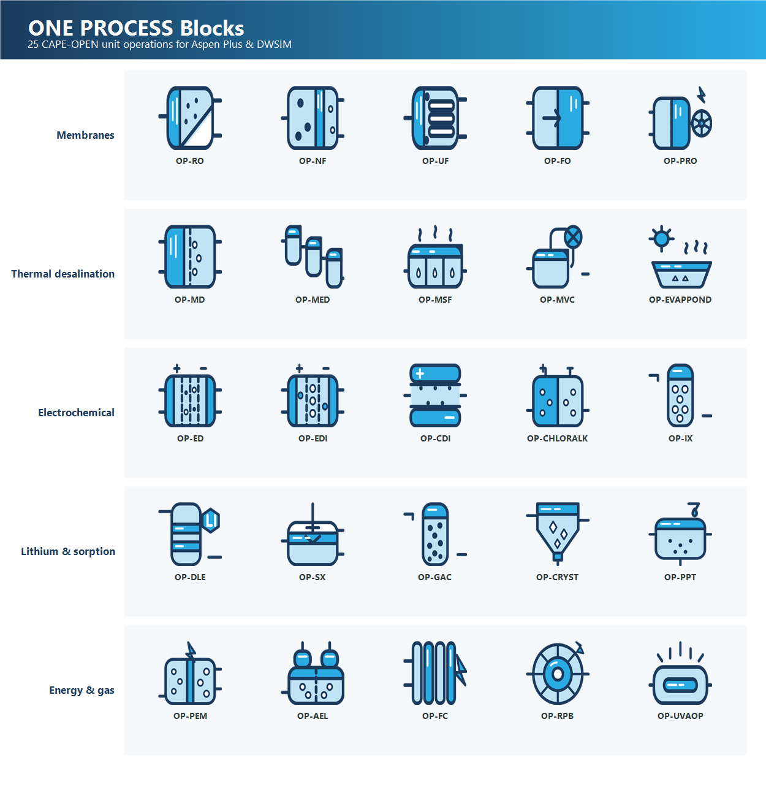

# ONE PROCESS Blocks (OP-Blocks)

**English** · [العربية](README.ar.md)


**25 open-source CAPE-OPEN unit operations for water, desalination, lithium and
green-energy flowsheets — built for Aspen Plus V14.**



Every block follows the same engineered pattern: a pure physics engine with
published references, host-safe CAPE-OPEN wiring, a two-tab Input/Results form,
and a validation test suite pinned to textbook anchors. **369 unit tests, all
green** (per-block validation suites + framework tests), plus live
COM-activation and in-Aspen palette verification.

> 📷 *In-Aspen screenshots to be added at release: the CAPE-OPEN palette in
> Aspen Plus V14 with all 25 blocks, and a converged OP-RO seawater case.*
> <!-- TODO(release): add docs/media/palette.png and docs/media/op-ro-run.png -->

---

## Honest status — read this before using

We distinguish two verification tiers and do not blur them:

| Tier | Meaning |
|---|---|
| ✅ **Host-verified** | Ran **converged** inside Aspen Plus V14 with exact mass balance, determinism across 20 runs, and results identical to the stream table. |
| 🧪 **Physics-validated** | Full unit-test suite green against **published data anchors** on two CAPE-OPEN thermo backends (1.0 + 1.1), activates through real COM, and appears in the live Aspen palette — but a converged in-host run has **not** been executed yet. |

### Block catalog

| Family | Block | Physics (references in `docs/OP-*_MODEL.md`) | Status |
|---|---|---|---|
| Membranes | **OP-RO** Reverse Osmosis | Solution-diffusion, avg-osmotic bisection, ERD, Rating/Design modes | ✅ Host-verified (IDEAL + ELECNRTL) |
| Membranes | **OP-NF** Nanofiltration | Spiegler–Kedem σ, multivalent selectivity (Kedem 1958; Mohammad 2015) | 🧪 Physics-validated |
| Membranes | **OP-UF** Ultrafiltration | Darcy flux, size exclusion — salts pass (Cheryan 1998) | 🧪 Physics-validated |
| Membranes | **OP-FO** Forward Osmosis | Module-avg Δπ + reverse salt flux (Cath 2006; McCutcheon 2006) | 🧪 Physics-validated |
| Membranes | **OP-PRO** Pressure-Retarded Osmosis | W = A(σΔπ−ΔP)ΔP, exact ΔP* = Δπ/2 optimum (Loeb 1976; Achilli 2010) | 🧪 Physics-validated |
| Thermal | **OP-MD** Membrane Distillation | DCMD vapour flux, Knudsen-scaled Bm, Antoine Psat (Schofield 1987) | 🧪 Physics-validated |
| Thermal | **OP-MED** Multi-Effect Distillation | GOR = 0.85·N shortcut, brine CF advisories (El-Dessouky ch. 8) | 🧪 Physics-validated |
| Thermal | **OP-MSF** Multi-Stage Flash | Once-through y = cpΔT/λ, honest ~9 % recovery, PR ≈ 10 (El-Dessouky ch. 6) | 🧪 Physics-validated |
| Thermal | **OP-MVC** Mech. Vapour Compression | Isentropic steam work, SEC in the 8–16 kWh/m³ band (El-Dessouky ch. 7) | 🧪 Physics-validated |
| Thermal | **OP-EVAPPOND** Solar Evaporation Pond | Dalton/aerodynamic + brine activity + solar closure (Penman 1948; Sartori 2000) | 🧪 Physics-validated |
| Electrochemical | **OP-ED** Electrodialysis | Faraday transport, Ohmic stack, water drag (Strathmann 2004) | 🧪 Physics-validated |
| Electrochemical | **OP-EDI** Electrodeionization | Faradaic cap + water-splitting regeneration (Ganzi 1987) | 🧪 Physics-validated |
| Electrochemical | **OP-CDI** Capacitive Deionization | SAC + charge efficiency Λ (Porada 2013; Suss 2015) | 🧪 Physics-validated |
| Electrochemical | **OP-CHLORALK** Chlor-Alkali Cell | Membrane-cell Faradaics, 2.44 kWh/kg Cl₂ at 3.1 V (O'Brien 2005) | 🧪 Physics-validated |
| Electrochemical | **OP-IX** Ion Exchange | Equivalents softening, Ca/Mg selectivity (Helfferich 1962) | 🧪 Physics-validated |
| Lithium & Sorption | **OP-DLE** Direct Lithium Extraction | Langmuir + Glueckauf LDF, Mg/Li selectivity (Langmuir 1918) | 🧪 Physics-validated |
| Lithium & Sorption | **OP-SX** Solvent Extraction | Kremser cascade — exact 14/15 anchor (Kremser 1930; Seader 3e) | 🧪 Physics-validated |
| Lithium & Sorption | **OP-GAC** Activated Carbon | Freundlich + carbon usage rate + bed life (MWH ch. 15) | 🧪 Physics-validated |
| Lithium & Sorption | **OP-CRYST** Crystallizer | Solubility-limited Mullin yield (Mullin 4e; CRC tables) | 🧪 Physics-validated |
| Lithium & Sorption | **OP-PPT** Chemical Precipitation | Stoichiometric, reagent-limited (Metcalf & Eddy 5e) | 🧪 Physics-validated |
| Energy & Gas | **OP-PEM** PEM Electrolyzer | Faraday + exact SEC = 26.59·V/η kWh/kg (Carmo 2013) | 🧪 Physics-validated |
| Energy & Gas | **OP-AEL** Alkaline Electrolyzer | Shared Faradaic engine, alkaline ranges (Ursúa 2012) | 🧪 Physics-validated |
| Energy & Gas | **OP-FC** PEM Fuel Cell | Faraday + exact η_LHV = V/1.253 (O'Hayre 3e) | 🧪 Physics-validated |
| Energy & Gas | **OP-RPB** Rotating Packed Bed | HiGee NTU = k·√RPM absorption (Ramshaw 1981; Chen 2005) | 🧪 Physics-validated |
| Energy & Gas | **OP-UVAOP** UV / Advanced Oxidation | First-order dose-response + Bolton EEO (Bolton 2001) | 🧪 Physics-validated |

Every block, both tiers: named ports, **RealParameter-only** inputs (the one
type Aspen's CAPE-OPEN grid renders), an output-parameter Results grid,
engineering warnings, and a "Model & References" section in the block report.

## Install (3 steps)

1. **Download** the latest release (`OPBlocks_Setup.exe`, or
   `OPBlocks-1.0.0-portable.zip` and extract anywhere).
2. **Register** the blocks (one UAC prompt): run the **OP-Blocks Manager** and
   click *Register all*, or from PowerShell:
   `powershell -ExecutionPolicy Bypass -File scripts\register-all-blocks.ps1`
3. **Open Aspen Plus V14** → Model Palette → **CAPE-OPEN** tab — all 25 OP
   blocks are there. Drag, drop, connect, run.

Requirements: Windows 10/11 x64, Aspen Plus V14, .NET Framework 4.8 (in-box on
Windows). The DWSIM adapter ships in the source tree but is **experimental and
untested in v1.0** — Aspen Plus is the supported host.

## Build from source

```powershell
# .NET 8 SDK (block DLLs target net48; Manager targets net8)
dotnet build tests\UnitTests\UnitTests.csproj -c Release   # builds all block families
dotnet test  tests\UnitTests\UnitTests.csproj -c Release   # full validation suite
scripts\package-blocks.ps1                                  # assemble blocks\ runtime layout
scripts\build-installer.ps1                                 # portable zip (+ Setup.exe if Inno Setup 6 present)
```

Note: `OPBlocks.sln` includes the experimental DWSIM adapter, which needs a
DWSIM installation to compile — build the test project as shown above for the
Aspen-facing library.

## How validation works (the "block factory")

Each block is built against the same gates (full engineering journal:
[`HANDOFF.md`](HANDOFF.md)):

1. **Pure engine in `OPBlocks.Core`** — physics only, shared by the block and
   its tests so they cannot drift; hand-written equations with citations and a
   validity range (`docs/OP-*_MODEL.md`).
2. **Structural gate** — block == engine within 0.1 % on canonical cases,
   replayed through the real CAPE-OPEN interfaces on both Thermo 1.0 and 1.1
   mock hosts.
3. **Physical anchors** — closed-form and published-data checks (Faraday to
   1e-9, Kremser 14/15 exact, steam-table Psat, NaCl solubility, PRO ΔP* = Δπ/2 …).
4. **Determinism** — 20 consecutive runs bit-stable below 1e-8.
5. **Results = streams** — the block's Results grid equals the outlet streams
   exactly; total mass balance to 1e-9.
6. **Host rules** — RealParameter-only (anything else blanks Aspen's grid),
   thermo exclusively from the host property package, volumetric flows from
   package mass ÷ package density (unit-convention safe).

## Repository layout

| Path | Contents |
|---|---|
| `src/OPBlocks.Core` | `UnitBase`, `ThermoProxy`, physics engines, reporting, persistence |
| `src/OPBlocks.{Desalination,Electro,Lithium,Energy}` | The 25 CAPE-OPEN block classes |
| `src/OPBlocksManager` | WPF installer/registration manager |
| `tests/UnitTests` | 369 validation tests (per-block suites + framework) |
| `docs/` | Per-block model sheets (equations + references + anchors), architecture, spec |
| `scripts/` | build / register / package / installer scripts |
| `installer/` | Inno Setup script, Aspen palette (`ONE PROCESS.apm`), templates |

## Roadmap — Phase 2 (planned)

v1.0 delivers 25 custom CAPE-OPEN blocks for Aspen Plus V14. Phase 2 aims to
grow OP-Blocks from a block library into a **platform**. This is a direction,
not a shipped feature set — nothing below is done yet.

**1. Aspen HYSYS support** — the same physics core exposed through the HYSYS
Extension mechanism, so every block can run across all three major simulators
(Aspen Plus, DWSIM, HYSYS).

**2. 34 new blocks** across new families:

| Family | Examples |
|---|---|
| Signature | Diesel Generator (realistic exhaust + heat rejection), Concrete/Aggregate Crusher |
| Bioprocess | BioReactor, Anaerobic Digester, Crossflow UF/DF, Centrifuge, Chromatography, Crystallizer |
| Engineering-standard | Relief Valve (API 520), Restriction Orifice (ISO 5167), Fired Heater (API 560), Cooling Tower |
| Refinery shortcut | Shortcut CDU, FCC, Claus SRU, Amine Treater, Hydrocracker, Reformer, HDS, Coker |

**3. The Converter** *(the headline idea)* — build your **own** block with the
help of any AI. Copy a prompt from the OP-Blocks Manager, paste it into any AI,
describe the equipment you want, and get back a JSON recipe. Upload it, and a
pre-registered generic block configures itself — ports, parameters, equations,
results — and installs into your simulator. No coding, no compiler. Export and
share blocks as `.opblock` files, turning OP-Blocks into a community.

**Design principles carried from v1.0:** rigorous vs. screening accuracy
labeled per block, thermodynamics always delegated to the host property
package, and every block validated against the literature before release.

> Phase 2 is a roadmap, not a release, and its pace depends on real interest.
> **If a specific block or simulator matters to you — ⭐ star the repo and open
> a [Discussion](https://github.com/NawafFai/op-blocks/discussions) or an
> [issue](https://github.com/NawafFai/op-blocks/issues).** That feedback
> decides what gets built first.

## Contact

Questions, bug reports, or collaboration: **alahmadnf@outlook.com**
(Engineer Nawaf — ONE PROCESS Simulation). Please open a GitHub issue for bugs
so others can benefit.

## License

[MIT](LICENSE) © ONE PROCESS Simulation. "ONE PROCESS" and the OP-Blocks marks
remain trademarks of ONE PROCESS Simulation — see the trademark notice in the
LICENSE file. Third-party components (including the public-domain EPA
CAPE-OPEN .NET class library) are documented in
[THIRD-PARTY.md](THIRD-PARTY.md). Not affiliated with Aspen Technology, Inc.
or the DWSIM project.
